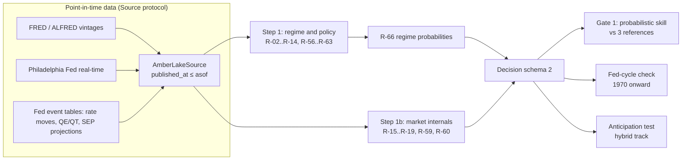

# fatpitch

[](https://github.com/maren-epochs/fatpitch/actions/workflows/tests.yml)


A point-in-time process model of a discretionary global-macro investment process, rebuilt from public interviews and speeches, and a research harness that tests whether the model reproduces the documented decisions better than simple baselines.

The model follows Stanley Druckenmiller's publicly described "fat pitch" approach: liquidity and the Federal Reserve set the regime, the chart can veto, size follows conviction, and the default is cash. Every rule is traced to a dated source, every number is either his or written down with its reasoning, and every input is read only as it was published at the time.

**Full write-up:** [docs/OVERVIEW.md](docs/OVERVIEW.md) (architecture, evaluation design, decision log with predictions vs results, limitations).

> A process model built from public sources. Not affiliated with or endorsed by Stanley Druckenmiller or Duquesne. Not investment advice.

## What it does

`fatpitch.evaluate(asof, source)` returns a `Decision` for any date since 1950, using only data whose publication time is on or before `asof` (4 p.m. New York time):

- a regime vector per region (US, euro area, Japan, UK): daily probabilities of Fed easing, on hold or tightening, liquidity impulse, policy-error sign, inflation vetoes and a fragility gauge;
- a market-internals vector (leading industries, breadth, curve and credit, momentum, cross-asset trend);
- the evidence lines behind each call, and the inputs consumed with their publication times and vintages.

Steps 2–7 of the process (thesis, expression, veto, sizing, monitoring, cash default) are specified in `spec/process.md` and not yet implemented; the engine returns "no pitch" until they are.



## Engineering choices

| Problem | Approach | Where |
|---|---|---|
| Look-ahead from revised data | Every input carries `published_at`; snapshots filter on it, never on period end. Revised series are read from the vintage in force (ALFRED, then Philadelphia Fed real-time, else marked unusable). | `src/fatpitch/source.py`, `src/fatpitch/lake.py` |
| Rules that drift from the source | 67 rules, each tagged `stated` (with a library citation), `interpreted`, or `interpreted-from-article` (weight 0). A parameter registry enforces at most 8 tunable parameters, all interpreted. | `spec/process.md`, `spec/registry.yaml`, `src/fatpitch/registry.py` |
| Overfitting the evaluation | 80 dated cases in 23 episodes; a third of the episodes are a sealed holdout with sha256 tamper checks, opened once at the end. Every scoring run is logged append-only and p-values are Holm/Bonferroni-adjusted over all trials. | `cases/`, `src/fatpitch/cases/holdout.py`, `results/versions/trials.jsonl` |
| Changes whose effect cannot be attributed | Each spec version is a git commit run in an isolated worktree; changes are staged one per commit and measured as the difference from the step before. | `src/fatpitch/versions/` |
| Base-rate gaming | Gate 1 scores ranked probability skill against leave-one-episode-out climatology, a 12-month trend and an always-easing forecaster, with an exact episode sign-flip test, plus a hard requirement on tightening cases. | `spec/scoring.md` §6c |
| Decisions made after seeing results | Each design decision is logged with its options, the evidence, and a prediction written before the run; the measured result is added next to the prediction. 95 decisions so far. | `spec/decisions.yaml` |
| Unknown data treated as a signal | Missing or stale inputs return `unknown`, which never counts as pass or fail. | `src/fatpitch/rules/outputs.py` |

## Results so far (research split; holdout sealed)

| Check | Current engine | Requirement | Status |
|---|---|---|---|
| Gate 1: regime probability skill | RPS 0.184; skill +0.25 vs climatology, +0.36 vs 12-month trend, +0.31 vs always-easing; 7 of 13 episodes won vs climatology (p 0.266) | positive skill and p < 0.10 against each reference | fail |
| Tightening requirement | skill +0.73 vs always-easing on the 6 tightening cases | positive | pass |
| Fed-cycle check (Fed's own history, 1970–2026) | 14 of 17 tightening cycles detected at the first hike; 13.6% false alarms | ≥ 75% detected, ≤ 20% false alarms, beat four references | pass |
| Anticipation test, first design (hybrid track) | caught 61% of hikes and 17% of cuts before the first move | ≥ 60% and at least the naive 2-year rule (78% / 61%) | fail |
| Anticipation test, redesign (exploratory retest) | hikes 83% caught, median lead 1.0 month; cuts 61%, lead 1.0 month | as above, plus lead ≥ the 2-year rule's (1.5 / 1.0 months) | fail on hike lead only; cut side passes but matches the 2-year rule |

How the engine got here, measured one change at a time (full log in `results/versions/LEADERBOARD.md`):

| Stage | Change | Gate 1 RPS | Fed cycles detected |
|---|---|---|---|
| 0 | Baseline regime engine | 0.249 | 4/17 |
| 2 | Fed balance-sheet signal from announced QE/QT programmes instead of weekly holdings arithmetic | 0.232 | 6/17 |
| 3 | Rate moves take precedence over the balance-sheet signal | 0.220 | 6/17 |
| 5 | Scorer reads the engine's own tie rule (a numpy argmax had resolved every tie to easing) | 0.220 | 14/17 |
| 6 | Policy direction as a Fed cycle state: the last move holds until the opposite move | 0.184 | 14/17 |

## Repository map

| Path | Content |
|---|---|
| `src/fatpitch/` | Package: `Source` protocol and lake reader, `Decision` schema, rule engine (`rules/`), cases, scoring and nulls (`cases/`), statistics (`stats/`), version runner (`versions/`), pre-registration (`prereg.py`) |
| `spec/` | Process specification, parameter registry, scoring rules and gates, data catalogue, Fed event tables, decision log, research notes |
| `cases/` | Case corpus (one YAML per dated documented decision), holdout manifest |
| `library/` | Source index: one front-matter record per interview or speech (date, venue, reliability, link). Note bodies are withheld because they excerpt third-party material. |
| `results/versions/` | Trial log and leaderboard |
| `versions/` | Snapshots of tagged spec versions |
| `tests/` | 330+ tests; network blocked and clock frozen for every test |
| `tools/` | Case builders, rulebook generator, research scripts |

## Running it

```powershell
python -m venv .venv
.\.venv\Scripts\python.exe -m pip install -e ".[dev]"
.\.venv\Scripts\python.exe -m pytest -q
```

The test suite runs on fixtures and needs no data. Real evaluations read a local parquet lake (FRED/ALFRED, Philadelphia Fed, Fed event tables) through `AmberLakeSource`; set `AMBER_DATA` to its location. The lake builder lives in a separate repository and is not included.

```powershell
python -m fatpitch.versions run WORKTREE     # score the working tree on the research split
python -m fatpitch.versions leaderboard      # rewrite results/versions/LEADERBOARD.md
python -m fatpitch.cases.anticipation        # Fed anticipation test (hybrid track)
```

## Status

Research mode: the specification is still changing, so pre-registration is deferred and every run is counted as an exploratory trial. Next: diagnose the remaining Gate 1 misses (the 2024 easing read), test R-68 (inflation versus the Fed's own projections), then steps 2–7 of the process.

Built with Python 3.13, polars, numpy and scipy, on Windows. Developed with AI pair-programming (Claude Code); design decisions, data choices and acceptance criteria are recorded in `spec/decisions.yaml`.
