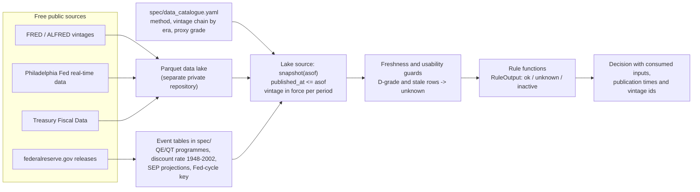
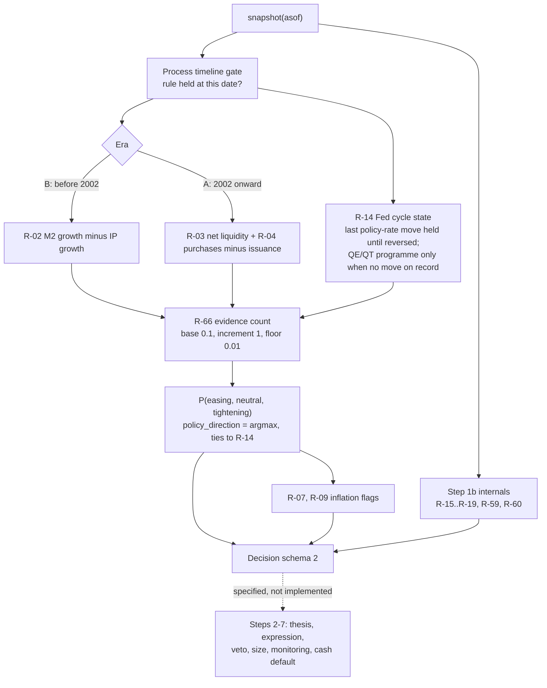
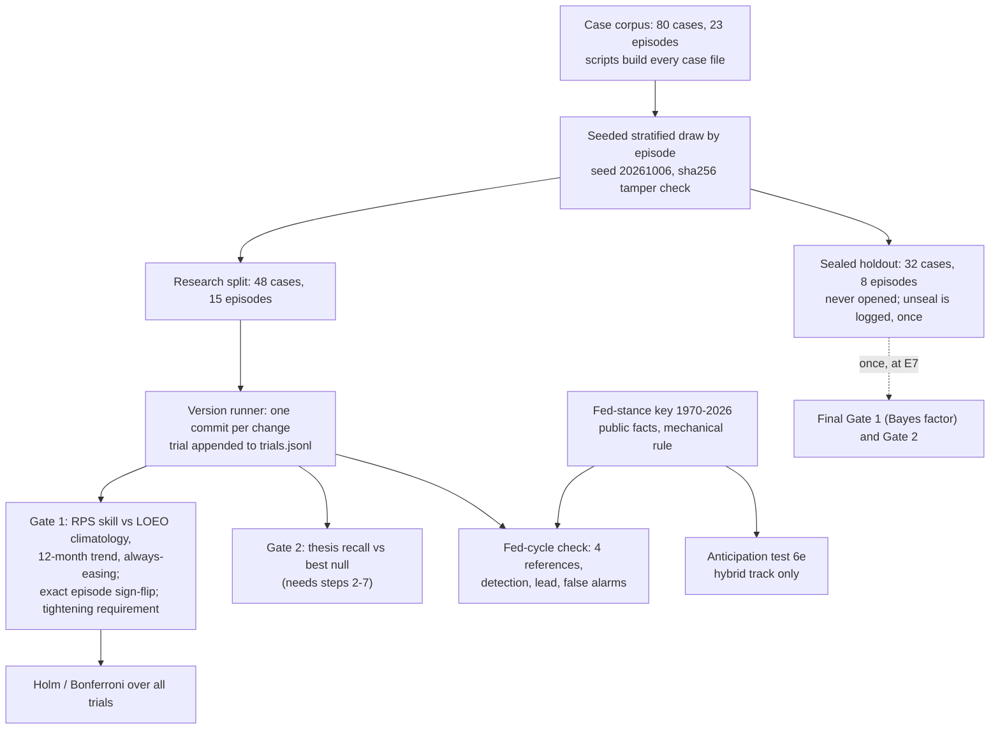
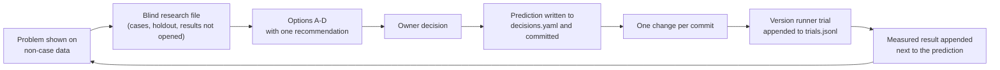

# fatpitch: a point-in-time process model of a discretionary macro investor

Project overview and research write-up. Author handle: maren-epochs. Status as of 2026-10-07: research mode, steps 1 and 1b of a seven-step process implemented, sealed holdout never opened.

> **Disclaimer.** This repository contains a process model built from public sources: published interviews, speeches, transcripts and secondary summaries. It is not affiliated with or endorsed by Stanley Druckenmiller or Duquesne Family Office. Nothing here is investment advice. The model's output is a mechanical reading of rules extracted from public statements, never a statement of any person's views, and it is never rendered in the first person.

Every number in this document is taken from a file in the repository, and the file is named next to the number. Where a result does not exist yet, the text says so.

---

## Contents

1. Summary
2. The problem
3. Source library and rule extraction
4. Point-in-time data architecture
5. The engine
6. Evaluation design
7. How decisions were made
8. Results to date
9. Engineering practices
10. Limitations, threats to validity and roadmap
11. Appendix A: glossary
12. Appendix B: rule index

---

## 1. Summary

The project asks whether a discretionary global-macro process, known only from what its practitioner has said in public, can be written down as explicit rules and then checked against the decisions he documented. The subject is Stanley Druckenmiller's publicly described "fat pitch" approach: liquidity and the Federal Reserve set the regime, the chart can veto a trade, position size follows conviction, and the default is cash. In his words at the 2022 Sohn conference (conversation with John Collison, late May or early June 2022): "I'm waiting for a fat pitch."

The repository contains three things:

| Component | Content | Where |
|---|---|---|
| Specification | 68 rules (R-01 to R-68), each with a citation, a tag (`stated`, `interpreted`, `interpreted-from-article`), a formula, parameters, inputs and known conflicts | `spec/process.md` |
| Engine | Python package `fatpitch`; `fatpitch.evaluate(asof, source)` returns a `Decision` using only data published by `asof` | `src/fatpitch/` |
| Evaluation harness | 80 dated cases in 23 episodes, a sealed holdout, null models, two staging gates, a check against the Fed's own history, an anticipation test, a trial log with multiple-testing adjustment, and a log of 95 design decisions with predictions recorded before measurement | `cases/`, `spec/scoring.md`, `results/versions/`, `spec/decisions.yaml` |

Key results on the research split and the Fed's own history (sources: `results/versions/LEADERBOARD.md`; `spec/decisions.yaml` R67-04 and R67-05):

| Check | Current engine (commit a2a5fc8, trial 9) | Requirement | Status |
|---|---|---|---|
| Gate 1: regime probability skill on documented reads | RPS 0.184; skill +0.253 vs leave-one-episode-out climatology, +0.364 vs 12-month trend, +0.314 vs always-easing; 7 of 13 episodes won vs climatology, binding p 0.266 | skill > 0 and exact episode sign-flip p < 0.10 against each reference | Fail |
| Hard tightening requirement | skill +0.730 vs always-easing on 6 tightening cases | positive | Pass |
| Fed-cycle check (Fed's own record, monthly 1970 to 2026) | 14 of 17 tightening cycles detected within ±3 months of the first hike; median lead 0 months; false alarms 13.6% of easing months | ≥ 75% detected, ≤ 20% false alarms, beat four references | Pass |
| Anticipation test, first design of R-67 (hybrid track) | 61% of hikes and 17% of cuts anticipated before the first move | ≥ 60% and at least the naive 2-year rule (78% / 61%) | Fail |
| Anticipation test, redesign R-67 v2 (exploratory retest, same history) | 83% of hikes, 61% of cuts; hike median lead 1.0 month vs 1.5 for the naive rule | as above, plus lead and false-alarm criteria | Fail on one criterion (hike lead); R-67 stays a warning flag |
| Gate 2: thesis recall | 0.000 on 29 cases (steps 2 to 7 not implemented) | beat best null, recall ≥ 0.50 | Not yet testable |

What is not done: steps 2 to 7 of the process (thesis generation, expression, veto, sizing, monitoring, cash default) are specified but not implemented, so the engine returns "no pitch" on every date. Pre-registration is deferred while the specification is still changing; every scoring run is logged as an exploratory trial instead. The holdout has never been opened. The anticipation rule R-67 failed both its first test and its single permitted redesign retest, and remains a warning flag outside the gated regime output.

---

## 2. The problem

### 2.1 From statements to a testable model

A discretionary investor does not publish a rulebook. What exists is a few dozen interviews and speeches spread over four decades, most given years after the decisions they describe, plus summaries written by third parties. The statements are qualitative ("money supply growing a lot faster than industrial production"), occasionally numeric ("we've never had a soft landing after inflation has got above 4.5%", as summarised from Sohn 2022), and sometimes inconsistent across tellings. The 1992 sterling trade, for example, is described with fund sizes of $7B, $7.5B and $10B and starter positions of $1.5B going to $5B or $5.5B depending on the source (`spec/process.md` section 9).

The project treats the problem as a specification exercise followed by a measurement exercise. Each statement that implies a rule is extracted with its citation; every number the source does not give is written down as an interpretation with its reasoning; and the resulting engine is run point-in-time over history and compared with the dated decisions the investor described.

### 2.2 Why the measurement is hard

| Difficulty | Concrete form in this project | Response |
|---|---|---|
| Few documented decisions | 80 cases, clustered in 23 episodes; cases within an episode are not independent, so the effective sample is the episode count (`spec/HOLDOUT.md`) | Episode-first aggregation; exact episode-level tests; sealed holdout |
| Base rates | 92.6% of research-era regime reads are "easing" (25 of 27 era-A cases); a constant "always easing" forecast scores 0.926 on agreement, leaving a perfect engine at most 7.4 points of headroom (`spec/regime_evaluation_options.md` section 1) | Proper scoring rule (RPS) with skill against several references, including the constant |
| Revised data | Macroeconomic series are revised for years; the 1990s value of a 1981 statistic is not what was known in 1981. First-release payrolls move 50k to 110k per month by the latest vintage (`spec/decisions.yaml` LAB-01) | Every input carries a publication timestamp; revised series are read from the vintage in force (section 4) |
| Hindsight in the sources | Most statements are retrospective; the investor's own accounts of a trade can be dated after the outcome | Cases marked `retrospective`; information dates set to the last close before first publication; mistakes and failed calls kept in the corpus |
| Designer leakage | The person writing the rules has read the outcomes | Transition table authored before case reading and frozen; holdout sealed with hashes; predictions recorded before each measured change |
| Unreachable cases | Political catalysts (1992 ERM exit, 2016 election) cannot be generated from data | `mechanizable: no` tag; reported separately as a fidelity ceiling (8 such cases, `spec/HOLDOUT.md`) |

The project's position is that a fidelity claim is only meaningful if each of these problems has an explicit, checkable mitigation. Most of the work in the repository is that machinery rather than the rules themselves.

---

## 3. Source library and rule extraction

### 3.1 The library

The source library holds one record per event: an interview, a speech or a secondary summary, with front matter for date, venue, reliability and link. There are 92 records: 20 in `library/reference_sources/` and 72 in `library/discovered_sources/`. Reliability, as coded in front matter, is 13 primary, 21 near-primary (transcripts) and 58 secondary summaries. In the public export the note bodies are withheld because they excerpt third-party material; the index and front matter remain.

Reliability matters because the same claim can rest on a verbatim transcript or on a blogger's paraphrase. The specification cites the reliability code with every quote, and gaps are listed explicitly in `spec/process.md` section 10.1. Two examples: the Economic Club of New York talk of May 2020, which underlies the net-liquidity rules, is available only through a secondary verbatim excerpt (the transcript was not found), so rule R-04 "rests on a secondary excerpt"; and the 1988 Barron's interview is a paywalled teaser with no rule content.

Before the specification was written, 13 claims in the project's starting reference document were checked against the library and corrected where the evidence disagreed (`spec/decisions.yaml` PROC-11). Examples: "93% invested, net flat" in 2019 is verified only as "over 90%"; the "sizing is 70 to 80% of the game" figure is the investor's own statement at Sohn 2022, not a third party's; and a note calling the "inflation above 5% has not fallen without fed funds above CPI" rule a summarizer's error was itself wrong. Unsupported claims are listed in `spec/process.md` section 10.2 and are not encoded as stated rules.

### 3.2 Rules and tags

The process is organised as seven steps (`spec/process.md`; PLAN section E.1): regime and policy (1), market internals (1b), thesis generation (2), expression selection (3), veto (4), tier and size (5), monitoring and exits (6) and cash default (7). Rule identifiers are stable and never reused. R-01 to R-55 were fixed before library reading, when the transition table was authored; R-56 to R-65 were added after reading; R-66 to R-68 were added during phase E3. The specification held 65 rules at the spec-v0.1 tag (`CHANGELOG.md`) and holds 68 now.

Every rule and every parameter carries one of three tags:

| Tag | Meaning | Count (rules, `spec/process.md` headings) |
|---|---|---|
| `stated` | The principle, and any number, appears in a primary or near-primary note as the investor's own statement. The operational formula may still be an interpretation, and the formula line says so | 51 |
| `interpreted` | The principle or construction is an inference from statements, not his formula | 13 |
| `interpreted-from-article` | Origin is a 2026 newsletter article (see 3.4) with no primary support; default weight 0 | 4 |

A parameter may be tagged `stated` only when the number itself appears as his statement; mapping his words to a weight or threshold is `interpreted` (`spec/decisions.yaml` PROC-12). Three parameters were retagged from stated to interpreted under that rule, including a timing weight of 0.2 taken from his remark that technicals are now about 20% as effective as they were.

The parameter registry (`spec/registry.yaml`) is the single source of every number used in a formula. At the time of writing it holds 129 entries: 29 `stated`, 96 `interpreted` and 4 `interpreted-from-article` (121 entries before the R-67 v2 and R-68 constants were added). At most 8 entries may be tunable, all of them `interpreted`; the cap is full:

| Tunable parameter | Value | Search range |
|---|---|---|
| `liq.m2_ip.spread_pp` (M2 growth minus IP growth threshold) | 3.5 | [1.0, 7.0] |
| `policy.tg_threshold_pp` (Taylor-gap threshold) | 2.0 | [1.0, 3.0] |
| `xasset.window_m` (rates, oil and dollar window) | 6 | [3, 12] |
| `fragility.high_percentile` | 80 | [70, 90] |
| `internals.rs_lookback_m` | 6 | [3, 12] |
| `curve.cut_pricing_bp` | 50 | [25, 50] |
| `chart.trend_lookback_w` | 40 | [20, 52] |
| `tier.min_independent_evidence` | 3 | [2, 4] |

Each interpreted entry records an evidence grade (direct, anchored, convention, none) and states that no value was chosen by checking case outcomes. The registry loader (`src/fatpitch/registry.py`) enforces the cap, the tunable-implies-interpreted rule, and that every `stated` citation resolves to a library file.

A worked example of an interpretation. Rule R-02 cites the investor at a 2009 Citi fireside chat: "If you have the money supply growing a lot faster than industrial production, the stock market is generally going to go up." "A lot faster" is unquantified. The real-time median gap between M2 growth and industrial-production growth, 1980 to 2026, is 3.37 points; 3.5 was chosen as the smallest round value above it, with a tunable range of [1, 7] spanning roughly the 27th to 77th percentiles, and no engine output or case was consulted (`spec/registry.yaml`, `spec/decisions.yaml` D1).

### 3.3 Conflicts between sources

Where the sources disagree, the specification records both versions and the resolution (`spec/process.md` section 9). Examples: the stated thesis horizon ranges from 6 to 12 months (Bloomberg 2015) to 18 months to 3 years (Morgan Stanley 2026), resolved as an 18-to-36-month thesis horizon; the liquidity measure varies from M2 versus industrial production (2009) to Fed purchases net of Treasury issuance (2020), resolved as a family of rules scored by data era; technicals are described as "very effective" in the early 1990s and about 20% as effective in 2026, resolved as a retained veto with low timing weight.

### 3.4 The article comparison track and its provenance

A widely circulated 2026 newsletter article ("Automated Alpha") presented a stock-screening filter under the investor's name. The project initially treated its non-attributable elements as a third tag at weight 0 (`spec/decisions.yaml` PROC-03), then built every element as an article-origin rule so three versions can be compared: faithful, article-faithful and hybrid (TRACK-01). The audit counted 167 article elements: 17 covered by an existing rule, 16 already weight-0 rules, 50 partly covered and 84 missing (TRACK-01 measured result).

A provenance study (`library/research/article_provenance.md`) tested four hypotheses for the non-attributable elements: the author's own house framework, statements the library missed, unpublicised fund practice, or table-stakes practice. The documented finding is that the first dominates: most of the modules appear in the author's earlier, unrelated posts and are reused across frameworks attributed to other investors. Several elements contradict stated positions, for example price stops against "never used a stop loss" and contrarian positioning against his stated view that the crowd is usually right. Those elements run only in the article track; in the hybrid, the faithful rule governs where the two overlap.

### 3.5 Claims catalogue and process timeline

Two further artefacts separate "what he believed" from "when he believed it" (`spec/claims/`, decision PROC-14):

| Artefact | Content | Counts |
|---|---|---|
| `spec/claims/claims.yaml` | Every general regularity he asserted, formalised as a falsifiable hypothesis with variables, thresholds, a test and an out-of-sample split at the date of first public statement | 76 claims: 51 testable with free data, 17 partly testable, 8 untestable |
| `spec/claims/process_timeline.yaml` | For each rule, `held_from`, `held_until` and a weight code per era (E1 1977-1987 to E5 2020-2026) | 38 of 76 claims and 29 of 61 of his rules have thin dating evidence (`spec/claims/README.md`) |

The timeline lets the engine apply "the process as of date t" when replayed backwards. A rule is held in an era unless its code is `absent` or `n/a`; an `unknown` code counts as held because absence is not evidenced (`spec/process.md` R-66). The claims README records a limitation directly: many claims were first stated in 2022 to 2026, so their out-of-sample windows are four years or shorter and are anecdotal.

---

## 4. Point-in-time data architecture

### 4.1 The contract

Every input reaches the engine through one interface (`src/fatpitch/source.py`):

```
Source.snapshot(asof) -> {series_id: frame}
frame columns: value (Float64), period_end (Date),
               published_at (Datetime, America/New_York, never null), vintage_id (Utf8)
```

The rules of the contract are short. `asof` must be timezone-aware New York time. Availability is decided by `published_at <= asof`, never by `period_end`. Rows without a publication timestamp are excluded with a warning. For each period the most recently published row at `asof` is returned, which is the vintage in force. All series in one snapshot come from one consistent read. Date-only timestamps are read as the end of that day, which errs toward seeing data late rather than early. The randomised property test that no returned row has `published_at > asof` was the acceptance criterion of the first phase (`tests/test_source.py`).

Two failure modes motivated the contract (`spec/decisions.yaml` PROC-08). The Fed's weekly balance-sheet release (H.4.1) is dated Wednesday but published Thursday at 16:30 ET, so a join on observation date leaks one day. Output-gap inputs to a Taylor rule are heavily revised, so a backtest on current data uses information no one had.

### 4.2 The catalogue and vintage selection

The production source (`src/fatpitch/lake.py`) reads a local parquet data lake built by a separate private data-lake repository; the builder is not part of this repository and the test suite never touches it. What this repository owns is the catalogue, `spec/data_catalogue.yaml`, which maps every input id named in the specification to a location, a frequency, a point-in-time method and a chain of vintage stores by era.

| Catalogue field | Counts at the time of writing (181 input ids) |
|---|---|
| Status | available 140, partial 23, substitute 12, missing 4, proxy only 2 |
| Dominant point-in-time method | lag rule 63, release calendar 59, first release 38, vintage 21 |
| Vintage stores referenced | ALFRED 23, Philadelphia Fed Real-Time Data Set 4 |

A typical entry is M2: from 1980-02-08 the snapshot reads ALFRED vintages; from 1971-05-31 to 1980-02-08 it reads the Philadelphia Fed real-time data set (quarterly vintages, pre-1980 M2 definition); earlier values exist only as the latest revision and are returned with `usable = False`. Industrial production uses first-release logic, which the M2-minus-IP rule requires. Unemployment is read from its first release.

Substitutes and proxies carry a grade from A (native) to D, computed on the overlap with the primary series using thresholds from `library/research/data_practices.md` section 4.2 (for example, grade B requires correlation of at least 0.95, beta between 0.9 and 1.1 and sign agreement of at least 90%). D-graded rows are returned but marked unusable, so gating rules see them as unknown. The French 12-industry portfolios, served as a stand-in for the missing 49-industry set, are graded D because no overlap exists to validate them.

### 4.3 Event tables built from Fed releases

Some inputs are not time series in any free database and were built by hand from primary releases, each row timestamped at its publication time:

| Table | Content | Verification |
|---|---|---|
| `spec/fomc_bs_events.yaml` | 28 state changes of Fed balance-sheet programmes (expand, runoff, none) from a 1914 baseline through QE1 to QE4, tapers and the two runoff periods, each with the release URL | Release times from federalreserve.gov; rows whose time is from memory are flagged `time_verified: false` and all precede 16:00 ET |
| `spec/fed_discount_rate_events.yaml` | 130 discount-rate changes, 1948 to 2002, used as the policy-rate record before the fed funds target series begins in 1982-09 | Implied monthly averages match the IMF series in all 396 months 1950-01 to 1982-12 within 0.05 percentage points |
| `spec/fomc_sep_events.yaml` | FOMC Summary of Economic Projections, 76 releases from 2007-10 to 2026-09-16, medians, central tendencies, ranges and dot-plot statistics | Fed Table 1 against ALFRED: 2,584 values agree, 14 differ (13 stale ALFRED values, 1 documented); the Fed value is kept |
| `spec/fed_cycles.yaml` | Fed-stance answer key, monthly 1970-01 to 2026-09, built by a mechanical rule (section 6.4) | Changes from 1990 match the Board's published tables 110 of 110 |

### 4.4 Freshness and unknown propagation

Visibility is not enough: a discontinued series remains visible forever. A freshness guard (`src/fatpitch/rules/series.py`) makes a series unknown at `asof` when its newest usable period is older than the larger of a frequency bound (daily 10 days, weekly 21, monthly 75, quarterly 200, annual 760) and the series' own cadence (median publication lag plus 1.5 times the median spacing plus 7 days).

Every rule returns a typed `RuleOutput` whose status is `ok`, `unknown` or `inactive` (outside the rule's active spell in the process timeline) (`src/fatpitch/rules/outputs.py`). Unknown and inactive are never a pass or a fail; downstream consumers treat both as no evidence, and when every input family is unknown the regime probabilities are unknown rather than uniform. The same principle applies to scoring: a null case target is excluded from every aggregate.

A coverage report generated from the catalogue (`spec/data_coverage.md`) states the cost of this discipline plainly. A point-in-time snapshot of the 67 step-1 inputs takes 9.5 ms (3,483 weekly snapshots, 1960 to 2026). But 0 of the 11 research cases dated before 2002 have every step-1 input available point-in-time: the Treasury General Account series starts in 2002-12, the Chicago Fed financial conditions index was first published 2011-05-25 (earlier values are a backcast), and the 49-industry portfolios, the deficit-to-GDP series and a historical FOMC calendar are missing.



---

## 5. The engine

### 5.1 Scope

`fatpitch.evaluate(asof, source)` (`src/fatpitch/engine.py`) takes one point-in-time snapshot and computes steps 1 and 1b: a regime vector for each of four regions (US, euro area, Japan, UK) and a market-internals vector. Steps 2 to 7 are specified in `spec/process.md` and a 25-row transition-to-thesis table (`spec/transition_table.yaml`, authored before case reading and frozen), but not implemented; the decision stays "no pitch" with the cash default. The order of evaluation is fixed in `src/fatpitch/rules/regime.py`: timeline gate, step-1 rules, liquidity family by era, R-14, R-66 probabilities, the rules that take the policy direction as an input (R-07, R-09), then step 1b.

### 5.2 Liquidity family by era

The investor's only long-history liquidity rule is money growth against industrial production (R-02, 2009). Later statements frame liquidity as the Fed's balance sheet net of Treasury cash and reverse repos, or Fed purchases net of Treasury issuance (R-03 and R-04, 2020 and 2022). Choosing a pre-2002 proxy by its fit to a 2020s construction he did not use would have made the early era a test of a different rule (`spec/decisions.yaml` PROC-06). The family is therefore scored where each member exists: era B (before 2002, monthly) uses R-02; era A (2002 onward, daily) uses the sign of R-03 plus R-04; when the era's member is unknown or not held, the other era's member is used and labelled as a fallback. Overlap fit between members is a diagnostic, not a selection criterion.

### 5.3 R-14: policy direction as a Fed cycle state

R-14 is the rule that defines `policy_direction`. Its source statements are a 2014 playbook summarised as "stay long until the Fed tightens" (Delivering Alpha, 2014-07-16) and, on the My First Million podcast (2021-05-11): "the minute they start tightening, the equity market should go down a lot." Its current form is the result of three measured changes (section 7):

1. **Balance-sheet component from announced programmes** (R14-01). The original component read week-to-week changes in Fed securities holdings, which also move for currency demand, sterilisation and settlement timing. It read the 2004-06 hikes and the 2008 cuts as neutral and treated any slowdown in purchases as tightening. A research pass over 30 dated statements on QE, tapering and QT found that he describes stimulus as on or off, calls QT tightening, and never calls a US taper tightening (`spec/research_R14_balance_sheet.md`). The component now reads the programme state from the event table: a purchase programme in force (taper included) is easing, announced runoff is tightening, otherwise nothing.
2. **Rate move takes precedence** (R14-02). When the policy rate and the balance-sheet programme disagree, the rate decides, consistent with the Fed naming the policy rate its primary tool (FOMC principles, 2022-01-26). The only long disagreement was 2024-09 to 2025-11, cuts during slowed runoff, which he read as easing.
3. **Cycle state** (R14-04). The original rule took the sign of the six-month change in the policy rate. A printout of the engine's votes on Fed history alone showed it forgot the cycle six months after each move: 2003 and early 2004 read neutral at 1% rates before any hike, 2014-11 to 2015-11 read neutral at zero rates. The rule now holds the direction of the last policy-rate move until a move in the opposite direction. The policy-rate record is the target range upper bound from 2008-12-16, the target rate from 1982-09-27 and the discount-rate event table before; a level difference at a join between records is not a move. Because a rate state exists at every date after 1950, the balance-sheet programme now decides only when no rate change is on record, and keeps a separate "QE ended recently" setback flag.

### 5.4 R-66: regime probabilities

The evaluation (section 6) scores probabilities, so the engine must emit P(easing), P(neutral) and P(tightening) daily. No source states such a mapping, and the tunable cap was full, so R-66 is a transparent evidence count with three fixed constants (`spec/process.md` R-66; `src/fatpitch/rules/probability.py`):

```
mass[c] = base + sum over known, held families f pointing to class c of increment x weight(f)
P[c]    = mass[c] / sum(mass), floored at 0.01 and renormalised
```

The US vector counts two families: R-14 and the era's liquidity rule. With base 0.1 and increment 1, two agreeing families give 0.913 / 0.043 / 0.043, a split gives 0.478 / 0.478 / 0.043 with the call going to R-14's class, and one known family gives 0.846 / 0.077 / 0.077. Rules that measure the level of policy against a benchmark (the Taylor gap R-06, financial conditions R-58) are excluded because the investor reads "change, not level"; rules that take the policy direction as an input are excluded as circular; vetoes, fragility, duration evidence and equity internals are excluded with reasons. The probabilities are coarse by design and uncalibrated; calibration is out of scope until the final phase.

### 5.5 Decision schema 2

The `Decision` dataclass (`src/fatpitch/decision.py`) validates its vocabularies on construction and round-trips to JSON and to parquet (one row per decision, nested Arrow structs). Schema 2 added the regime probabilities: each at least 0.01, summing to 1, with `policy_direction` set to the argmax and rejected if inconsistent, except that a tie may resolve to any tied class. A `Decision` also carries every consumed input with its publication time and vintage id, the registry hash, the engine version, nearest misses and the "no pitch" flag. The single mapping from a `Decision` to a scorable `Prediction` lives in `src/fatpitch/versions/adapter.py` and is applied identically to every version.



---

## 6. Evaluation design

### 6.1 Case corpus and episodes

A case is one YAML file per dated documented decision (`cases/<YYYY-MM-DD>_<slug>.yaml`, schema in `src/fatpitch/cases/schema.py`), with an as-of time at the New York close, an era, an episode id, targets (regime direction, theses, expression, action, size band) and metadata that scoring and engines never read. Case files are generated by scripts (`tools/build_cases.py`, `tools/build_cases_v2.py`, `tools/build_13f_cases.py`) rather than edited by hand.

Two tags handle cases the engine should not be rewarded for matching. `truth_type: process` marks decisions the investor himself described as breaking his process, such as the 2000 technology purchase; the target is the stated rule's output, and matching his action scores as a miss. `mechanizable: no` marks decisions driven by unforeseeable events. A regime label means the policy stance as he read it at the information date, not his prescription and not the later outcome; policy he judged too loose is coded easing even while the Fed was hiking (`spec/decisions.yaml` CORPUS-03).

Corpus composition (version 5 split, `spec/HOLDOUT.md`):

| Count | Research | Holdout | Total |
|---|---|---|---|
| Cases | 48 | 32 | 80 |
| Episodes | 15 | 8 | 23 |
| Era A cases / episodes | 37 / 9 | 28 / 5 | 65 / 14 |
| Era B cases / episodes | 11 / 6 | 4 / 3 | 15 / 9 |
| Thesis-target cases | 36 | 20 | 56 |
| truth_type process / action | 6 / 42 | 1 / 31 | 7 / 73 |
| mechanizable yes / partial / no | 42 / 1 / 5 | 28 / 1 / 3 | 70 / 2 / 8 |
| Source reliability primary / near-primary / secondary | 6 / 34 / 8 | 5 / 12 / 15 | 11 / 46 / 23 |

### 6.2 The sealed holdout

About one third of the episodes are sealed (`src/fatpitch/cases/holdout.py`). The draw is seeded (seed 20261006) and stratified, and never splits an episode. The default corpus load returns the research split; loading the holdout requires an explicit flag, an environment variable and a written reason, and appends a line to an append-only unseal log. Every load, research included, recomputes the holdout hash and raises on any mismatch: a changed byte, an added or removed file, or a case moved across the boundary. A research load reads only the episode id and bytes of holdout files and never parses their targets.

The split was redrawn four times, each time because a new or corrected case broke the tamper check by design, always with the same method and seed, always before any unseal and before any engine scoring, and each redraw is logged with its preconditions and exposures (`spec/HOLDOUT.md` re-seal log; `spec/decisions.yaml` HOLD-02). Exposures are disclosed rather than hidden: one unlogged null-only run on 2026-10-06 covered episodes that later redraws moved into the holdout (`spec/PREREG.md`). Version 5 holds out 8 of 23 episodes, 32 of 80 cases; holdout files sha256 `471996871e2b...6963`, all case files `d7b08bb89459...1de`. The reseal tool refuses once an unseal log exists, so the split cannot be redrawn after the holdout is opened.

### 6.3 Gate 1: probabilistic skill on documented reads

The first versions of Gate 1 compared regime agreement against the best null, then a timing gate. Both were shown to be unpassable or gameable: against a constant easing forecast, research headroom was zero, and with three holdout episodes the smallest attainable episode-level p was 0.125 (`spec/regime_evaluation_options.md` section 1; `spec/decisions.yaml` GATE-01). The current design (GATE-02, `spec/scoring.md` section 6c) adopts the forecast-verification convention:

| Element | Definition |
|---|---|
| Set | Research cases with a regime target, era A and era B: 32 cases in 13 episodes (26 easing, 6 tightening) (`results/versions/LEADERBOARD.md`) |
| Score | Ranked probability score at each case as-of, ordinal classes easing < neutral < tightening, floor 0.01; a missing forecast scores the worst attainable value |
| Aggregation | Mean per episode, then unweighted mean over episodes |
| References | Leave-one-episode-out (LOEO) climatology, add-one smoothed; `null_trend_12m`; constant always-easing at 0.9 / 0.05 / 0.05 |
| Test | For each reference, skill = 1 − RPS_engine / RPS_ref, and an exact one-sided sign-flip test over all 2^k sign patterns of the per-episode differences |
| Pass | Skill > 0 and p < 0.10 against every reference (binding p = the largest), and the tightening requirement below |
| Headroom | With k = 13 the smallest attainable p is 1/2^13; p < 0.10 needs at least 4 episodes all won, or more episodes with a few losses |

The always-easing reference was added after a check showed that, under a two-reference draft, the constant forecast won 6 of 9 research episodes against the trend null (p 0.164); one more winning episode would have let a constant pass from the base rate alone (GATE-03). A hard tightening requirement was added on top: on the tightening cases the engine's mean RPS must beat always-easing's (0.856), so an engine that cannot call tightening fails regardless of its other scores (GATE-05). Era-B cases joined the set specifically to add tightening examples (GATE-04, CORPUS-12). All three choices were made before any engine emitted probabilities.

Reported next to the gate, with their chance levels and not gated: bracketed daily path agreement between consecutive agreeing statements (holdout date ranges masked), Cohen's kappa and balanced accuracy, AUC of P(tightening), and interval-censored turning-point matching.

### 6.4 The Fed-cycle check

The documented reads alone cannot show that the engine recognises real tightening: his reads often diverge from Fed action (2004-06 read as still too loose; March 2022 read as easing because the Fed was "still buying bonds"). A second required check scores the engine against the Fed's own record (GATE-06, `spec/scoring.md` section 6d). The answer key is built mechanically: every change in the fed funds target from 1982, with runs below 0.25 points dropped (otherwise the 1980s borrowed-reserves regime produces 44 cycles, some of 6.25 bp); turning points of monthly fed funds before 1982; QT periods count as tightening; easing dominates. The key has 681 months (easing 214, neutral 211, tightening 256) and 17 evaluable tightening cycles. Because the labels are public facts rather than the sealed documented reads, holdout-period months are scored.

Pass requires positive mean RPS skill against four references (LOEO-by-cycle climatology, trend, always-easing and a rule that reads only realised rate changes, `null_fed_direction`); detection of tightening within ±3 months of the first hike in at least 75% of cycles; at least as many cycles detected, at least as early, as `null_fed_direction`; and false alarms in no more than 20% of easing months. The fourth reference was added when the rate-change rule passed the three-reference version: the engine must read Fed tightening better than simply reading rate changes (GATE-07). A known tension is recorded and left unchanged: an engine faithful to his reads may score worse here, so Gate 1 and this check can pull in opposite directions. Overall regime pass is Gate 1 and this check.

### 6.5 The anticipation test

R-14 is realised by construction: it turns at or after the first move. Anticipating a turn is a separate question with its own test (`spec/scoring.md` section 6e), fixed before any computation. For each Fed turn since 1970 the signal at the last month-end before the first move must point in the turn's direction; the lead is the length of the uninterrupted run ending there; a false-alarm month is a reading with no move of that direction in the following six months. Pass requires, separately for hikes and cuts: hit rate at least 0.6 with median lead at least one month; hit rate and lead at least those of a naive rule (sign of the 2-year yield minus fed funds beyond ±50 bp) with false alarms no more than one month per year above it; false alarms at most 3 months per year; and no era with evaluable turns at zero hits. An unknown signal at the decision date is excluded from denominators, never counted as a miss.

### 6.6 Gate 2, nulls, multiple testing

Gate 2 is the hard go/no-go for the project: on era-A cases with thesis targets, thesis recall must beat the pre-chosen best null (`null_trend_12m`) in a paired sign-flip test at p < 0.10 and reach at least 0.50 (`spec/scoring.md` section 7). It cannot be tested until step 2 exists. Four nulls are scored with the identical rule through the same engine interface (`src/fatpitch/cases/nulls.py`): always risk-on, Fed direction only, a 12-month trend of equities, Treasuries and the dollar, and persistence of the most recent case's targets with a 120-day embargo.

Every engine scoring run on the research split is a trial appended to `results/versions/trials.jsonl`, which is never rewritten; re-runs of an unchanged version count. Holm and Bonferroni adjustments of each gate's p are computed over all logged trials, and the same count feeds the deflated Sharpe ratio when performance is reported. At the time of writing N = 9 engine trials (8 distinct configurations), and the Holm-adjusted Gate 1 p of every version is 1.000 (`results/versions/LEADERBOARD.md`).

### 6.7 Pre-registration, deferred

The package includes a pre-registration registry (`src/fatpitch/prereg.py`) that hashes the specification, registry, transition table, corpus manifest, scoring rules and holdout file, and logs every scoring run. Nothing has been registered (`spec/PREREG.md`). The owner's decision was to hold registration until the rulebook had been reviewed, because the project is in research mode and many filter changes are expected (`spec/decisions.yaml` VER-03). The substitutes in the meantime are the sealed holdout, the append-only trial log with multiple-testing adjustment, and the decision log with predictions written before each measured change. All research-split results in this document are therefore exploratory.



---

## 7. How decisions were made

### 7.1 The protocol

Design decisions are recorded in `spec/decisions.yaml`: 95 entries at the time of writing, each with the question, the options considered, the option chosen, who decided, how, the evidence files, the expected result and, where one exists, the measured result. Decided-by codes: 40 by the owner directly, 41 by the owner on a recommendation, 14 derived mechanically from earlier decisions or the specification. 45 entries carry a measured result. For entries from the third working session of 2026-10-07 onward, the expected result was written before any staged result was read, and the measured result is appended afterwards without replacing the prediction; earlier entries were compiled from the specification and changelog and say "not stated at the time" where no prediction exists.

The protocol that produced the later entries has five steps:

1. **Problem statement** in plain language, with the defect shown on data that contains no case answers (for example, a vote-by-vote printout of the engine on Fed history).
2. **Blind research file.** A research note is written before any option is chosen, with its reading list and the files it did not open stated at the top. For example, `spec/research_R14_balance_sheet.md` and `spec/research_market_implied_fed.md` record that `cases/`, `cases/HOLDOUT.yaml` and `results/` were not opened.
3. **Options with a recommendation.** Lettered options A to D, one recommended, each with a one-line trade-off (decision PROC-15, adopted after a batch of jargon-heavy questions could not be answered).
4. **Owner decision with the prediction written first.** The expected effect on each gate is recorded in the decision entry and committed before the run.
5. **Staged measurement.** One change per commit; each commit is run by the version runner as a separate trial; the effect of each change is read as the difference from the previous stage (VER-02, adopted after the owner pointed out that four changes in one run would be unattributable).

Development used AI pair-programming (Claude Code); the owner, maren-epochs, made the design decisions, which are recorded with their options and rationale in `spec/decisions.yaml`.



### 7.2 Worked examples: predictions against measured results

The table pairs each prediction with what was measured. Stage numbers refer to section 8.1. "Against" marks a prediction the measurement contradicted.

| Decision | Change | Prediction (recorded before the run) | Measured | Verdict |
|---|---|---|---|---|
| R66-01 | Probability base mass 1.0 → 0.1 | Calls unchanged, so Fed-cycle detection unchanged; Gate 1 effect at this stage "neutral or negative" because the faulty holdings signal is still present | Calls unchanged (4/17 cycles, 7.5% false alarms); Gate 1 RPS worsened 0.249 → 0.273; Fed-check skill vs the rate-change reference flipped to −0.036 | As predicted |
| R14-01 | Balance-sheet component from announced programmes | 2004-06 reads tightening, 2008 cuts easing; fewer false tightening dates in the 2010s; false alarms fall; Gate 1 improves | Gate 1 RPS 0.273 → 0.232; 2008 episode 0.137 → 0.005; cycles detected 4 → 6; false alarms rose 7.5% → 9.3%; 2010s skill fell +0.017 → −0.082; 2015 cycle still undetected | Partly against |
| R14-02 | Rate move wins over programme | Small effect, possibly none on research cases | 2024 episode 0.723 → 0.562; 2020s skill +0.051 → +0.262; Gate 1 RPS 0.232 → 0.220 | Against (larger) |
| R17-01 | Bond-signal QE test from the same programme table | Affects only step 1b; gates unchanged | Gate 1, tightening requirement and Fed-cycle check identical | As predicted |
| SCORE-01 | Fed-cycle scorer uses the engine's tie rule | The 2015 cycle becomes detected; false alarms rise slightly; Gate 1 unchanged | Cycles detected 6 → 14 of 17; false alarms 9.3% → 17.3%; Gate 1 unchanged at 0.220 | Against (far larger) |
| R14-04 | Fed cycle state replaces the 6-month window | 2003-04, 2014-15 and 2025 easing episodes improve; 2024 H1 stays wrong; false alarms may rise | EP08 0.354 → 0.288, EP12 0.330 → 0.137, EP21 0.427 → 0.213; EP20 stays 0.562; Gate 1 RPS 0.220 → 0.184, binding p 0.403 → 0.266; false alarms fell 17.3% → 13.6% | Mostly as predicted; false-alarm direction against |
| R67-03 | Anticipation test thresholds fixed before computation | Post-1994 turns anticipated more reliably than 1970s turns; the per-era rule the likeliest criterion to fail | First run (R67-04): hikes 0.61 vs 0.78 for the naive 2-year rule, cuts 0.17 vs 0.61; the cut side failed broadly, not only on the per-era rule | Partly as predicted |
| R67-05 | V2-B redesign | Hit rates at least the naive rule's (0.78 / 0.61), leads at least its (1.5 / 1.0 months), false alarms above its by under one month per year; likeliest failures the per-era rule for 1982-1993 cuts or the cut false-alarm margin | Hikes 0.83 (15/18), lead 1.0 vs 1.5 months, false alarms 2.61 vs 2.03 per year; cuts 0.61 (11/18), lead 1.0, false alarms 0.39 vs 0.36; fails only on hike lead | Right on hit rates and false alarms; wrong on the failing criterion |

Three points from these rows deserve emphasis.

**Predictions were wrong in instructive ways.** The programme-based balance-sheet signal was expected to reduce false alarms and instead raised them, and the 2015 hiking cycle stayed undetected through stages 1 to 4 without an explanation at the time (R14-01 records it as an open item). The cause surfaced in the next decision. When the two US evidence families disagree, R-66 gives 0.478 / 0.478 and assigns the call to R-14's class, but the Fed-cycle scorer took the first class in the list, as `numpy.argmax` does on ties, which is always easing. That indexing artefact had never been specified. Fixing it under a citation of the R-66 tie rule (SCORE-01) raised detection from 6 to 14 of 17 cycles, where the prediction had named one cycle. Every tied month in a disagreement period had silently been scored as easing.

**An admitted mistake.** R-66 was first written with a base mass of 1.0, and the first recommendation to the owner was to approve it as written. That recommendation had not been checked against the scoring rule. With base 1.0 the largest attainable probability is 0.6, so a forecast with every direction correct still scores an RPS of 0.10 per date against roughly 0.00 for always-easing in an era that reads easing 93% of the time; Gate 1 was unpassable by construction. The recommendation was withdrawn before any R-66 score was read, and the new base mass (0.1) was derived from the RPS formula alone (R66-01; `spec/process.md` R-66).

**The owner overrode recommendations, and the log shows it.** For R-67 the recommendation was to split the rule by evidence, with the inflation part in the faithful track; the owner put both parts in the hybrid track because the library holds no statement of him using market pricing to forecast the Fed, and his record is trading against it (R67-02). For R-68 the recommendation was to display Fed projections as context; the owner chose to build a rule (R68-01), then placed it in the hybrid track only rather than the recommended faithful policy-error family (R68-02). For the inflation composite, the recommendation was a strict majority of four measures; the owner chose precision weighting of each measure's own reading (INFL-04). Each override is recorded with the recommendation it replaced.

### 7.3 The inflation and labour decisions

A review of every inflation statement in the library (`spec/research_inflation_measures.md`) produced four decisions:

| Decision | Choice | Reason recorded |
|---|---|---|
| INFL-01 | Read four measures in R-67: CPI headline and core, PCE headline and core | Owner instruction; the previous chain switched from headline to core CPI in 1996 and used unadjusted CPI before 1972, distorting 6-month changes |
| INFL-02 | Keep the 2% target on CPI and report the bias | No source gives a CPI-equivalent target; CPI ran about 0.45 points above PCE on average; switching measure in 2012 breaks the series |
| INFL-03 | Vetoes R-07 to R-09 read headline CPI year over year | CPI is the only index he names, and every number he gives (4.5%, 5%, 8%, 9.1%, 12%) is headline CPI |
| INFL-04 | Precision-weighted composite: each measure weighted by the inverse variance of its momentum reading's monthly change over the trailing 120 months (at least 36) | Owner instruction to weight each signal and take a cumulative reading; no outcome data, no hand-picked weights |

R-68 implements his Goldman Sachs statement (January 2021): "my overriding theme is inflation relative to what policymakers think." The formula is core PCE 6-month annualised inflation minus the Fed's own projection for the current year (SEP median from 2015-09, central-tendency midpoint before), with a 0.5-point band held for two month-ends, from 2007-11 only. It is report-only in the hybrid track and changes no gated output (`spec/process.md` R-68).

On labour data the decision was to add nothing beyond unemployment against its natural rate in R-06 (LAB-01): in a 2026 Morgan Stanley conversation he described payrolls and unemployment as the most misleading macro variables because they lag (note paraphrase), and first-release payrolls are revised by 50k to 110k per month.

---

## 8. Results to date

All results in this section are on the research split, exploratory and in-sample. The holdout has not been scored.

### 8.1 Staged runs

Each stage is one commit run as one trial (`results/versions/LEADERBOARD.md`; `spec/decisions.yaml` VER-02, R66-01, R14-01, R14-02, R17-01, SCORE-01, R14-04).

| Stage | Commit (trial) | Change | Gate 1 RPS | Binding p (episodes won vs climatology) | Fed cycles detected | False alarms | Agreement with his daily reads (chance) |
|---|---|---|---|---|---|---|---|
| 0 | c6fefbd (3) | Baseline regime engine | 0.249 | 0.512 (4/13) | 4/17 | 7.5% | 0.331 (0.316) |
| 1 | 8bb7d11 (4) | R-66 base mass 1.0 → 0.1 | 0.273 | 0.594 (6/13) | 4/17 | 7.5% | 0.331 (0.316) |
| 2 | 82bbdf9 (5) | R-14 balance sheet from announced programmes | 0.232 | 0.454 (7/13) | 6/17 | 9.3% | 0.721 (0.586) |
| 3 | c7f1623 (6) | Rate move wins over programme | 0.220 | 0.403 (7/13) | 6/17 | 9.3% | 0.747 (0.608) |
| 4 | 3fe11c8 (7) | R-17 QE state from the programme table | 0.220 | 0.403 (7/13) | 6/17 | 9.3% | 0.747 (0.608) |
| 5 | 3fe11c8 rescored (8) | Scorer uses the engine's tie rule | 0.220 | 0.403 (7/13) | 14/17 | 17.3% | 0.747 (0.608) |
| 6 | a2a5fc8 (9) | R-14 as a Fed cycle state | 0.184 | 0.266 (7/13) | 14/17 | 13.6% | 0.897 (0.709) |

Stage-4 and stage-5 rows share a commit; the leaderboard shows the latest run of each commit, so stage 4's Fed-cycle figures are taken from the R17-01 and SCORE-01 entries in `spec/decisions.yaml`.

### 8.2 Gate 1 against the references

For the current engine (a2a5fc8), from `results/versions/LEADERBOARD.md`:

| Model | Episode-first RPS | Class-balanced RPS | Tightening-subset RPS (6 cases) |
|---|---|---|---|
| Engine a2a5fc8 | 0.184 | 0.209 | 0.232 |
| LOEO climatology | 0.246 | 0.369 | 0.681 |
| Always easing | 0.268 | 0.431 | 0.856 |
| 12-month trend | 0.288 | 0.257 | 0.148 |
| Fed direction only | 0.244 | 0.234 | 0.148 |
| Persistence | 0.608 | 0.573 | 0.621 |

The engine has the lowest episode-first and class-balanced RPS of every model scored, and positive skill against all three references, but wins only 7 of 13 episodes against climatology and always-easing (p 0.266 and 0.254) and 9 of 13 against the trend null (p 0.193). Gate 1 needs p < 0.10 against each, so it fails.

The era breakdown shows where the remaining loss sits. On era A (9 episodes, almost all easing reads) the engine's skill is −0.370 against climatology and −0.726 against always-easing; on era B (4 episodes, mostly tightening) it is +0.599 and +0.681. The combined-set advantage therefore comes from the tightening episodes. In the easing-heavy modern era a constant easing forecast is still better, because climatology assigns easing episodes an RPS near 0.05 and the engine's probabilities are rarely that sharp.

### 8.3 Per-episode observations

From the per-episode table in `results/versions/LEADERBOARD.md` (mean RPS, lower is better):

| Episode | Target | Engine a2a5fc8 | LOEO climatology | Observation |
|---|---|---|---|---|
| EP09-2008-CRISIS | easing | 0.005 | 0.052 | Fixed by the programme-based balance sheet (0.137 at stage 1) |
| EP11-2012-13-QE | easing | 0.005 | 0.059 | QE read as easing throughout |
| EP18-2022-INFL | tightening | 0.005 | 0.695 | Tightening called with high confidence |
| EP07-2000-RATES, EP24-1991-EASE | tightening, easing | 0.005 | 0.654, 0.049 | Era B, called correctly |
| EP12-2014-15-DIVERGE | easing | 0.137 | 0.063 | Improved from 0.330 by the cycle state |
| EP08-2003-06-LOOSE | easing | 0.288 | 0.052 | His "too loose" read during hikes; structural conflict with a rate-based direction |
| EP20-2024-CUT | easing | 0.562 | 0.059 | Largest remaining loss; 2024 H1 read as tightening after the last hike, as predicted in R14-04 |
| EP01-1981-BONDS | tightening | 0.562 | 0.695 | Era B; better than climatology, not decisive |

### 8.4 Fed-cycle check

The current engine passes all four criteria (`results/versions/LEADERBOARD.md`): mean RPS 0.211; skill +0.135 against LOEO-by-cycle climatology, +0.276 against the trend null, +0.531 against always-easing and +0.053 against the rate-change reference; 14 of 17 cycles detected with median lead 0 months; false alarms 13.6% of easing months, against 18.2% for the rate-change reference and 32.2% for the trend null. The three undetected cycles all start in the 1970s (1972-03, 1975-06, 1977-02), and the 1970s are one of two decades with negative skill against climatology (−0.245; the other is the 2010s at −0.158). A median lead of 0 means the engine detects tightening at the first hike, not before it; anticipation is the subject of the next test.

### 8.5 Anticipation test: two designs, both failed

Both runs score the same Fed history, 18 hiking and 18 cutting turns (`spec/decisions.yaml` R67-04 and R67-05; naive-rule leads and false alarms from the R67-05 prediction text). The second run is an exploratory, in-sample retest: the redesign was written after the first result was known.

| Signal | Hikes: hit rate (hits / turns) | Hikes: median lead (months) | Hikes: false-alarm months per year | Cuts: hit rate | Cuts: median lead | Cuts: false-alarm months per year |
|---|---|---|---|---|---|---|
| Naive 2-year minus fed funds (reference) | 0.78 (14/18) | 1.5 | 2.03 | 0.61 (11/18) | 1.0 | 0.36 |
| R-67 design D3 (first run) | 0.61 (11/18) | not in decision log | not in decision log | 0.17 (3/18) | not in decision log | not in decision log |
| R-67 v2, design V2-B (retest) | 0.83 (15/18) | 1.0 | 2.61 | 0.61 (11/18) | 1.0 | 0.39 |

**First design.** Design D3 used a 3-to-6-month bill forward as the market signal and inflation momentum as a confirming guard and fallback. Cut anticipation was the main failure. The redesign note (`spec/research_R67_v2_R68.md` section 1) traced the failure to the construction rather than to the constants, without opening the answer key: a one-quarter horizon that misses the cumulative easing path priced in 1-to-2-year yields; flight-to-quality demand that pushes the bill forward toward "hike" exactly when stress precedes a cut; a guard keyed to inflation, which lags activity; and a pricing error. Computing the forward as twice the difference of discount yields understated it by 1 to 64 basis points at 2% to 15% rates, biasing the signal toward easing at high rates.

**Redesign.** V2-B (decisions R67-05 and R67-06) puts the 2-year path first, prices the bill forward from bill prices, uses the four-measure weighted inflation composite to fill hike calls, and adds an easing-side stress leg built only from existing stated rules. The redesign note stated in advance that a pass would be largely the 2-year rule and exploratory, and recorded a stopping rule: one retest, no third design.

**Retest result: fail on one criterion.** On hikes, the hit rate (0.83) exceeds the naive rule's (0.78) and false alarms (2.61 per year) stay within the permitted margin of one month per year above the naive rule's 2.03, and every era has hits; but the median lead is 1.0 month against the naive rule's 1.5, which fails criterion 2. On cuts, all four criteria pass, but the results are identical to the naive 2-year rule, so the stress leg added nothing measurable. The prediction recorded in R67-05 was right on the hit rates and on false alarms rising by less than one month per year, and wrong on which criterion would fail: it named the 1982-1993 cut era or the cut false-alarm margin, and the failure was the hike lead. Under the stopping rule no third design follows. R-67 remains a warning flag in the hybrid track, with no effect on the regime probabilities, Gate 1 or the Fed-cycle check.

---

## 9. Engineering practices

| Practice | Implementation | Where |
|---|---|---|
| Test suite | 331 tests collected at the time of writing; ruff clean (line length 110, target py312) | `tests/`, `pyproject.toml` |
| Network-blocked, frozen-clock harness | Every test runs with outbound sockets and DNS raising and with `fatpitch.dates.today()` pinned to 2026-10-06; a test must opt out explicitly with `@pytest.mark.allow_network`. No test reads real lake data; fixtures are built in temporary directories | `tests/golden.py`, `tests/conftest.py` |
| Continuous integration | GitHub Actions on Windows, Python 3.12 and 3.13: editable install, ruff, pytest | `.github/workflows/tests.yml` |
| Dependencies | polars, pyarrow, numpy, scipy, pyyaml, tzdata; no pandas in the package | `pyproject.toml` |
| Version runner | A git tag or commit is checked out into a temporary detached worktree; the version's own engine, specification and registry run in a child interpreter with that version's source first on `sys.path`, and the driver asserts the import came from there; scoring always uses the current code, so scores differ only through the version; the worktree is removed afterwards and the working checkout is never modified | `src/fatpitch/versions/` |
| Trial log | Append-only JSON lines with kinds `tag`, `wip` and `null`; nulls cached per corpus hash and not counted as trials; distinct configurations reported as a lower bound | `src/fatpitch/versions/trials.py`, `results/versions/trials.jsonl` |
| Reproducible builders | Case files, the Fed-cycle key, the holdout and the rulebook are generated by scripts, not edited | `tools/build_cases*.py`, `tools/build_13f_cases.py`, `tools/build_fed_cycles.py`, `tools/make_holdout.py`, `tools/build_rulebook.py` |
| Byte-stable hashing | Line-ending conversion is disabled for every file (`* -text` in `.gitattributes`), so case hashes are identical on every platform; the corpus hash is sha256 over sorted `relative_path NUL file_sha256 LF` lines | `.gitattributes`, `src/fatpitch/cases/schema.py` |
| Data lineage | Each catalogue entry names its vintage chain by era; each snapshot row carries a store-qualified vintage id (`alfred:<date>`, `rtdsm:<vintage>`), its point-in-time method, proxy grade and usability; each `Decision` lists the inputs it consumed | `spec/data_catalogue.yaml`, `src/fatpitch/lake.py` |
| Statistics | Newey-West and HAC regression, probabilistic and deflated Sharpe ratios, stationary bootstrap and timing-luck analysis, ported from an earlier private research codebase, for the descriptive performance report | `src/fatpitch/stats/` |
| Separation | The package never imports the data-lake repository; data enters only through a `Source`. The engine and scorers never receive a case or its targets; engines receive only a timestamp and a source | `src/fatpitch/source.py`, `src/fatpitch/cases/scoring.py` |
| Spec versions | Important changes become a git tag `spec-vX.Y` with a snapshot folder; three tags exist (spec-v0.1 to spec-v0.3) | `CHANGELOG.md`, `versions/` |

---

## 10. Limitations, threats to validity and roadmap

### 10.1 Limitations and threats

| Threat | Detail | Status |
|---|---|---|
| Small effective sample | Gate 1 rests on 13 research episodes; the tightening subset is 6 cases in 4 episodes; the holdout has 8 episodes. The smallest attainable holdout p is bounded by its episode count | Structural; mitigated only by more documented decisions, which the public record may not contain (a search found 0 confirmed new era-A regime turning points, CORPUS-10) |
| In-sample retests | Every staged change and the R-67 redesign were evaluated on the same research split or the same Fed history that motivated them. The R-67 v2 note says so explicitly | Disclosed; trial count adjusts p-values; the holdout is the out-of-sample test, opened once |
| Researcher degrees of freedom | 95 recorded decisions, several made after seeing staged results (R14-04 followed a stage 2 to 4 sequence) | Predictions recorded before each run; Holm-adjusted p is 1.000 for every version so far |
| Label subjectivity | A regime label is his read of the stance, which requires interpretation. A blind audit of 68 cases changed one label and flagged four as low confidence (CORPUS-04); several labels are medium confidence with no contemporaneous statement (CORPUS-07, CORPUS-08) | Labels decided from sources before re-seals; changes listed in `spec/corpus_v0.2_changes.md` and `spec/corpus_v0.3_changes.md` |
| Proxy grades and data gaps | 0 of 11 research era-B cases have every step-1 input point-in-time; industry rules are unknown in every era-B case; NFCI is unusable before 2011-05 | Unknown propagation keeps gaps from becoming signals; coverage reported beside results |
| Construction overlap | The QT windows in R-14's programme table and in the Fed-cycle answer key come from the same FOMC statements, so agreement there is by construction | Disclosed in `spec/process.md` R-14 |
| Retrospective sources | 23 cases rest on secondary sources; many statements describe trades years later | Reliability reported per case; information dates set conservatively |
| Divergence of goals | Fidelity to his reads (Gate 1) and agreement with the Fed record (section 6.4) conflict in periods such as 2004-06 | Recorded as a known tension, not tuned away |
| Pre-registration absent | Nothing is registered; research results are exploratory | Deferred by decision VER-03; trial log in place |
| Article provenance | The article track tests a construction mostly unrelated to the investor's record | Kept separate; weight 0 in the faithful track |
| Process timeline dating | 29 of 61 of his rules have thin start-date evidence | Replay should score both ways where dating is thin (PROC-14) |

### 10.2 Roadmap

The phases follow PLAN section E.7.

| Phase | Deliverable | Acceptance |
|---|---|---|
| E3 (current) | Steps 1 and 1b; R-68 report; R-67 retested once and kept as a warning flag | Gate 1 and the Fed-cycle check on research (Gate 1 not yet passed) |
| E4 | Steps 2 and 3: theses from the frozen transition table, premise ledger, expressions | Gate 2: thesis recall beats the best null (paired sign-flip p < 0.10) and reaches 0.50 |
| E5 | Step 4 veto per asset class, rates and FX first | Veto unit tests; unknown is not a fail; article-origin gates off |
| E6 | Steps 5 to 7: tier, size band, monitoring, cash default | Size-band and reversal cases scored; exit tests |
| E7 | Leave-one-episode-out calibration of the 8 tunables; single holdout opening; descriptive performance | Fidelity report against the gates; go or no-go per asset class |

Pre-registration of the specification, registry, transition table, corpus hash, scoring rules and holdout file is planned once the owner signals that research is complete; every scoring run after that goes through the run log.

---

## 11. Appendix A: glossary

| Term | Meaning |
|---|---|
| ALFRED | Archival FRED, the St. Louis Fed's store of past vintages of economic series; used to read a revised series as it was known on a date |
| AUC | Area under the ROC curve; here, how well P(tightening) separates tightening reads from others (chance 0.5) |
| Climatology (LOEO) | A reference forecast equal to the class frequencies of the other episodes' targets, leaving the scored episode out, add-one smoothed |
| Episode | A cluster of related cases (for example, the 2022 inflation episode); the unit of aggregation and of the exact tests |
| Era A / era B | 2002 onward (daily data, direct balance-sheet measures) / before 2002 (monthly data) |
| Fat pitch | In the investor's usage, a rare high-conviction opportunity; the model's default without one is cash |
| Holm / Bonferroni | Multiple-testing adjustments of a p-value for the number of trials run |
| H.4.1 | The Fed's weekly balance-sheet release, dated Wednesday, published Thursday 16:30 ET |
| Hybrid track | A version of the model that adds rules not attributable to the investor (such as anticipation from market pricing); kept separate from the faithful track |
| LOEO | Leave one episode out |
| PIT | Point in time: using only information published at or before the evaluation time |
| QE / QT | Quantitative easing (Fed asset purchases) / quantitative tightening (announced runoff of Fed holdings) |
| RPS | Ranked probability score: squared distance between cumulative forecast and outcome over ordered classes, from 0 (best) to 1 |
| RTDSM | Philadelphia Fed Real-Time Data Set for Macroeconomists, a source of historical vintages before ALFRED coverage |
| SEP | FOMC Summary of Economic Projections, published quarterly from 2007-10 |
| Sign-flip test | Exact test that enumerates all sign patterns of per-episode differences to obtain a p-value without distributional assumptions |
| Skill | 1 − RPS_model / RPS_reference; positive means better than the reference |
| Tag | `stated`, `interpreted` or `interpreted-from-article`, the provenance class of each rule and parameter |
| Unknown | A rule output when an input is missing, unusable or stale; never counted as a pass or a fail |
| Vintage | The version of a data series as published on a given date |

---

## 12. Appendix B: rule index

Generated from the headings of `spec/process.md`. Step: 1 regime and policy, 1b market internals, 2 thesis, 3 expression, 4 veto, 5 tier and size, 6 monitoring and exits, 7 cash default. Steps 2 to 7 are specified, not implemented.

| Id | Title | Tag | Step |
|---|---|---|---|
| R-01 | Liquidity and the Fed, not earnings, drive the overall market | `stated` | 1 |
| R-02 | Money growth minus industrial-production growth (liquidity rule i; era-B measure) | `stated` | 1 |
| R-03 | Fed assets − TGA − RRP (liquidity rule ii; era A) | `interpreted` | 1 |
| R-04 | Fed purchases − net Treasury issuance (liquidity rule iii) | `interpreted` | 1 |
| R-05 | Policy error is the main opportunity | `stated` | 1 |
| R-06 | Policy-error sign via unemployment-gap Taylor variant | `interpreted` | 1 |
| R-07 | No soft landing once inflation exceeds 4.5% | `stated` | 1 |
| R-08 | Above 5%, inflation has not fallen without FF above CPI | `stated` (with source caveat) | 1 |
| R-09 | Above 5%, inflation never tamed without recession | `stated` | 1 |
| R-10 | Rates, oil and USD rising together precede falling earnings and stocks | `stated` | 1 |
| R-11 | Fragility gauges (alert, non-gating) | `stated` (gauges) / percentile `interpreted` | 1 |
| R-12 | Cross-region policy block | `interpreted` | 1 |
| R-13 | Valuation is context only, judged relative to policy | `stated` | 1 |
| R-14 | Stay long until the Fed tightens; QE end and balance-sheet rate of change matter | `stated` | 1 |
| R-56 | 10-year yield trades around nominal GDP growth | `stated` | 1 |
| R-58 | Financial conditions as the restrictiveness gauge | `stated` (principle) / formula `interpreted` | 1 |
| R-63 | Fiscal supply as a duration driver | `interpreted` | 1 |
| R-66 | Regime probability mapping | `interpreted` | 1 |
| R-67 | Anticipated policy turn | `interpreted`; hybrid track only, warning flag | 1 |
| R-68 | Inflation relative to what policymakers think | `stated` (principle) / formula `interpreted`; hybrid track only, report-only | 1 |
| R-15 | Internals lead the economy by 6–12 months | `stated` | 1b |
| R-16 | Leading industries turning | `stated` (industries) / mapping `interpreted` | 1b |
| R-17 | Bond market and credit signal (impaired under QE) | `stated` | 1b |
| R-18 | Momentum bottoms 12–18 months before fundamentals; multi-horizon charts | `stated` | 1b |
| R-19 | Cross-asset trend | `interpreted` | 1b |
| R-59 | Leadership narrowing is a necessary (not sufficient) bear-market condition | `stated` | 1b |
| R-60 | Breadth thrust signals recovery 6–12 months out | `stated` (principle) / construction `interpreted` | 1b |
| R-20 | Never invest in the present; horizon 18 months to 3 years | `stated` | 2 |
| R-21 | Change, not level | `stated` | 2 |
| R-22 | Theses carry premises; premise end ends the thesis | `stated` | 2 |
| R-23 | Replay-safe forward policy view from the curve | `interpreted` | 2 |
| R-24 | Region-relative theses | `interpreted` | 2 |
| R-61 | Post-bubble bear markets last more than six months | `stated` | 2 |
| R-65 | Currency trends persist at least two years | `stated` | 2 |
| R-25 | Focus on what moves the security | `stated` | 3 |
| R-26 | Multi-asset menu; big bets in liquid markets; assets that rise when equities fall | `stated` | 3 |
| R-27 | Concentric circles (second-order expressions) | `stated` | 3 |
| R-28 | Payoff asymmetry ("one-way bet") | `stated` | 3 |
| R-29 | Chart veto: good thesis, bad chart → no trade | `stated` | 4 |
| R-30 | Price vs news (entry and re-check) | `stated` | 4 |
| R-31 | No contrarian fade | `stated` | 4 |
| R-32 | Technicals ~20% as effective → low timing weight, veto retained | `stated` | 4 |
| R-33 | Instrument liquidity | `interpreted` | 4 |
| R-34 | Accounting forensics gate | `interpreted-from-article` (weight 0) | 4 |
| R-35 | ROIC / fundamental quality gate | `interpreted-from-article` (weight 0) | 4 |
| R-36 | Smart money (Form 4 / 13F) gate | `interpreted-from-article` (weight 0) | 4 |
| R-37 | Contrarian COT positioning gate | `interpreted-from-article` (weight 0) | 4 |
| R-62 | Short-side entry: sidestep in poor risk/reward; short rallies, not lows | `stated` | 4 |
| R-38 | Invest, then investigate (starter → fat pitch) | `stated` | 5 |
| R-39 | One or two fat pitches a year | `stated` | 5 |
| R-40 | Sizing dominates (70–80% of the equation) | `stated` | 5 |
| R-41 | Gross leverage ≤ 4:1 | `stated` | 5 |
| R-42 | Equity net caps | `stated` | 5 |
| R-43 | FX cap 150–200% | `stated` | 5 |
| R-44 | Bonds ≤ 300% 10-year equivalents | `stated` | 5 |
| R-45 | Size to market liquidity: exit cost ≤ 1–2% of fund | `stated` | 5 |
| R-46 | Hot/cold governs size | `stated` | 5 |
| R-47 | House money; January 1 reset; never bet big to get even | `stated` | 5 |
| R-48 | Fragility modifies tier and size, never direction | `interpreted` | 5 |
| R-57 | Size scales with payoff asymmetry | `stated` | 5 |
| R-49 | No stop-losses; exit when the reason changes | `stated` | 6 |
| R-50 | Premise break → exit/reverse within one business day | `stated` | 6 |
| R-51 | Price vs news exit | `stated` | 6 |
| R-52 | Technical tops for exits | `stated` | 6 |
| R-53 | Self-scorecard | `interpreted` | 6 |
| R-54 | No pitch, no play | `stated` | 7 |
| R-55 | No long bias | `stated` | 7 |
| R-64 | Political cycle (display only, not used in v1) | `stated` | 7 |

Rule ids R-57 and R-64 sit outside the step ordering of their numbers because ids are assigned in order of addition and never reused. There is no gap in the id sequence.
